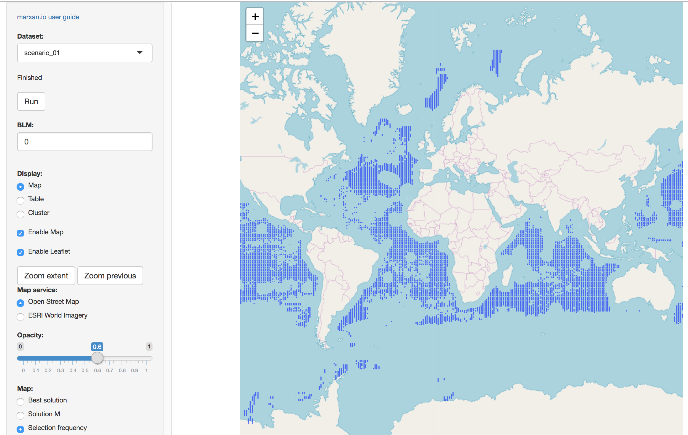

```{r setup, include=FALSE}
knitr::opts_chunk$set(echo = TRUE, message = F)
```


## Introduction {-}

In this conservation planning lab, you'll work with software Marxan to select sites for a reserve network that maximise species richness while minimizing site selection cost. In previous labs, you built a single species distribution model, evaluated connectivity between species habitat patches and calculated community metrics for species diversity between sites. As explained by Watson et al (2011) from this week's readings, site selection for a reserve network should include additional sites which are _complimentary_ to existing sites for maximizing species diversity. This problem is generally formulated in one of two ways:

1. **Minimum set problem**. Given a set of sites with various species compositions and costs for selection, what is the minimum set of sites that represents all species at the lowest cost?

1. **Maximal coverage problem**. Given a budget limit to total cost of sites selected, what is the maximum coverage of species representation possible?

In practice, these _conservation features_ of interest may be "fine filter" targets such as individual species, or "coarse filter" targets such as a general habitat (ie land cover class, or other environmental proxy).

Marxan uses the following input files [rows X columns] which you can find in the provided `scenario_01/input` folder:

- `spp.csv`: conservation features listed by id, $target$ amount and species penalty factor ($spf$) if target amount is unmet [species X properties]

- `pu.csv`: planning unit by id and $cost$ for selecting in reserve network. Optional columns are: status (0=available; 1=included in initial reserve; 2=locked in; 3=excluded); xloc and yloc used by optional sepdistance in spp.csv. [planning units X properties]

- `pu_vs_spp.csv`: $amount$ of species per planning unit [species * planning units X amount]

- `boundary.csv` $[$ optional $]$: shared $boundary$ length between planning units which gets dissolved as a function of the boundary length modifier ($BLM$) when used as an additional cost [planning units * planning units X boundary]

Marxan uses an objective function to minimize the value ($V$) of selecting sites, ie _planning units_, with minimal cost along with minimal penalty ($spf$) of excluding conservation feature targets:

$$
V = \sum_{pu_+} cost + \sum_{spp_-} spf + [BLM \sum_{pu_+} boundary]
$$

where:

- $pu_+$ are all the planning units in selected reserve network

- $spp_-$ are all the conservation features whose target amount is not met by selected reserve network

Optionally, clumping of sites can be encouraged by penalizing more boundary length with the boundary length modifier ($BLM$). Boundaries that are shared between sites get dropped. 

## Setup planning units shapefile: `pu.shp`

For conservation features, we'll use the 0.1 decimal degree global grid. 

```{r libraries & paths}
suppressPackageStartupMessages({
  library(tidyverse)
  library(glue)
  library(here)
  library(fs)
  library(sf)
  library(raster)
  library(RColorBrewer)
  library(leaflet)
  library(DT)
  library(rgeos)
  
  #library(bbnj)
  devtools::load_all()
})

dir_data     <- "~/Google Drive/projects/bbnj/data/derived"
p_hi_shp     <- file.path(dir_data, "boundary/high_seas.shp")
#cell_res <- 0.1     # n=2,834,323
cell_res     <- 0.5  # n=  113,401
p_cellid_shp <- file.path(
  dir_data, glue("boundary/high_seas_cellid_{cell_res}dd.shp"))
r_cellid_tif <- file.path(
  dir_data, glue("boundary/high_seas_cellid_{cell_res}dd.tif"))
r_fish_tif   <- file.path(dir_data, "fishing/gfw_revenue_0.5dd.tif")

v            <- 1 # marxan/scenario_{v}
dir_v        <- sprintf("%s/../marxan/scenario_%02d", dir_data, v)
v_pu_shp     <- file.path(dir_v, "pulayer/pu.shp")
v_pu_csv     <- file.path(dir_v, "input/pu.csv")
v_spp_csv    <- file.path(dir_v, "input/spp.csv")
v_spp_pu_csv <- file.path(dir_v, "input/spp_pu.csv")
v_pu_spp_csv <- file.path(dir_v, "input/pu_spp.csv")
v_bound_csv  <- file.path(dir_v, "input/bound.csv")
```

```{r functions}
get_tif_target <- function(path_tif){
  #browser()
  # get reasonable target based on the mean value * number of cells above mean
  message(basename(path_tif))
  r <- raster(path_tif)
  r <- cover(r, r_0) # plot(r)
  r_v <- r * r_area
  v <- values(r_v) %>% na.omit()
  m <- mean(v)
  sum(m * length(v >= m))
}

get_tif_pu_amount <- function(path_tif){
  message(basename(path_tif))
  r <- raster(path_tif)
  tibble(
    pu     = 1:ncell(r),
    amount = values(r * r_area)) %>% 
    filter(!is.na(amount), amount > 0)
}

focal_m <- function(side){
  # get rook neighbors
  m <- matrix(0, nrow=3, ncol=3)
  i <- c(left=2, top=4, bottom=6, right=8)
  m[i[[side]]] <- 1
  m
}

get_nbrs <- function(side){
  tibble(
    id     = values(r),
    id2    = values(focal(r, w=focal_m(side))),
    amount = values(r_length)) %>% 
    filter(!is.na(id), !is.na(id2))
}
```


```{r pu.shp}
# create planning unit shapefile
if (any(!file.exists(p_cellid_shp, r_cellid_tif))){
  r_na       <- get_grid(res=cell_res)
  r_cellid_n <- setValues(r_na, 1:ncell(r_na))
  p_hi       <- read_sf(p_hi_shp) #plot(r_cellid)
  r_cellid   <- raster::mask(r_cellid_n, p_hi) #plot(r_cellid_m)
  writeRaster(r_cellid, r_cellid_tif, overwrite=T)
  #cellids    <- values(r_cellid) %>% na.omit()
  p_cellid   <- rasterToPolygons(r_cellid) %>% 
    st_as_sf() %>% 
    rename(pu_id=layer)
  write_sf(p_cellid, p_cellid_shp)
}
p_cellid <- read_sf(p_cellid_shp)
r_cellid <- raster(r_cellid_tif)

# copy to marxan scenario dir
if (!file.exists(v_pu_shp)){
  write_sf(p_cellid, v_pu_shp)
}
#plot(p_cellid['id'], border=NA)

pal <- colorRampPalette(brewer.pal(11, "Spectral"))
cols <- rev(pal(255))
plot(r_cellid, col = cols, main="cellid")

qmap_r(r_cellid, "cellid")
```

## Setup planning unit table with cost from fishing: `pu.csv` 

Show first and last 100 rows of planning unit table where cost > 0.

```{r pu.csv}
r_fish <- raster(r_fish_tif) # plot(r_fish)

plot(r_fish, col = cols, main="cellid")

qmap_r(r_fish, "gfw_revenue")

if (!file.exists(v_pu_csv)){
  # TODO: check if right GFW metric, or need to scale by area

  r_fish <- raster(r_fish_tif) # plot(r_fish)
  
  # fill out NAs with 0 where in high seas
  r_0 <- get_grid(res = 0.5, val=0)
  r_0 <- mask(r_0, r_cellid) # plot(r_0)
  r_fish <- cover(r_fish, r_0) # plot(r_fish)
  
  t_pu <- tibble(
    id     = 1:ncell(r_fish),
    cost   = round(values(r_fish)),
    status = 0) %>% 
    filter(!is.na(cost)) %>% 
    arrange(id)
  write_csv(t_pu, v_pu_csv)
}
t_pu <- read_csv(v_pu_csv)

t_pu_gt0 <- filter(t_pu, cost>0)
head(t_pu_gt0, 100) %>% 
  bind_rows(
    head(t_pu_gt0, 100)) %>% 
  datatable() %>% 
  formatCurrency("cost", currency = "", interval = 3, mark = ",", digits=0)
```

## Setup species targets: `spp.csv`

So far:
- biodiversity

TODO:
- seamounts_count: 100 counts

```{r spp.csv}
dir_bio <- file.path(dir_data, "biodiversity")

r_area <- area(r_cellid)

if (!file.exists(v_spp_csv)){
  
  t_spp <- tibble(
    tif    = list.files(dir_bio, "spp_.*_be_0\\.5dd\\.tif"),
    path   = file.path(dir_bio, tif),
    id     = row_number(tif),
    name   = str_replace(tif, "spp_(.*)_be_0\\.5dd\\.tif", "\\1"),
    target = map_dbl(path, get_tif_target),
    spf    = 10)
  
  t_spp %>% 
    select(-tif, -path) %>% 
    mutate(target = round(target)) %>% 
    write_csv(v_spp_csv)
}

t_spp <- read_csv(v_spp_csv)

datatable(t_spp) %>% 
  formatCurrency("target", currency = "", interval = 3, mark = ",", digits=0)
```

## Intersect species with planning units: `spp_pu.csv`, `pu_spp.csv`

```{r spp_pu.csv}
tif <- list.files(dir_bio, "spp_.*_be_0\\.5dd\\.tif")[1]
path <- file.path(dir_bio, tif)

if (any(!file.exists(v_spp_pu_csv, v_pu_spp_csv))){
  t_spp_pu <- t_spp %>% 
    mutate(
      data = map(path, get_tif_pu_amount)) %>% 
    unnest(data) %>% 
    select(species = id, pu, amount)
  
  arrange(t_spp_pu, species, pu) %>% 
    write_csv(v_spp_pu_csv)
  arrange(t_spp_pu, pu, species) %>% 
    write_csv(v_pu_spp_csv)
}
```

## Boundary length file: `bound.csv`

- [mattwatts/CoESRA-Marxan](https://github.com/mattwatts/CoESRA-Marxan): Implement Marxan workflow components in R

- [prioritizr: Systematic Conservation Prioritization in R](https://cran.r-project.org/web/packages/prioritizr/vignettes/prioritizr.html)
  - [Systematic Conservation Prioritization in R • prioritizr](https://prioritizr.net/)

- [raptr: Representative and Adequate Prioritization Toolkit in R](https://cran.r-project.org/web/packages/raptr/vignettes/raptr.html)
  - [Representative and Adequate Prioritization Toolkit in R • raptr](http://jeffrey-hanson.com/raptr/)
  - Hanson et al (2018) [raptr: Representative and adequate prioritization toolkit in R](https://besjournals.onlinelibrary.wiley.com/doi/full/10.1111/2041-210X.12862) _Methods in Ecology and Evolution_
  
- [Systematic Reserve Design: Emulating Marxan in R](http://strimas.com/r/marxan/)
    - [Integer Programming with Gurobi for Reserve Design](http://strimas.com/r/gurobi/)
    - [Field Guide to ILP Solvers in R for Conservation Prioritization](http://strimas.com/prioritization/ilp-field-guide/)

- [RPubs - Biodiversidad y servicios](https://rpubs.com/dlizcano/bio-serv-marxan)

```{r bound.csv}
r <- r_cellid

# get length as sqrt(area); ie l*w=area
r_length <- area(r)^0.5

if (any(!file.exists(v_spp_pu_csv, v_pu_spp_csv))){
  t_bound <- get_nbrs("left") %>% 
    rbind(
      get_nbrs("top")) %>% 
    rbind(
      get_nbrs("bottom")) %>% 
    rbind(
      get_nbrs("right"))
  
  write_csv(t_bound, v_bound_csv)
}
```


## Run MarxanUI Shiny apps

```{r install marxanui, eval=F}
devtools::install_github("mattwatts/marxanui")

library(pacman)
p_load(
  "doParallel",
  "foreach",
  "foreign",
  "gplots",
  "Hmisc",
  "iptools",
  "labdsv",
  "leaflet",
  "maptools",
  "PBSmapping",
  "png",
  "rgdal",
  "rgeos",
  "rhandsontable",
  "rjson",
  "shiny",
  "shinyBS",
  "sp",
  "sqldf",
  "vegan",
  "xtable")
```

## Launch `marxanui` user interfaces from R

```{r, eval=F}
library(marxanui)       # Load the R package

launch_app("import")    # Launch the import app to import your own data

launch_app("marxan")    # Launch the marxan app to run Marxan

launch_app("mxptest")   # Launch the parameter testing app to do BLM, SPF calibration, and target sensitivity testing

launch_app("marzone")   # Launch the marzone app to run MarZone

launch_app("manage")    # Launch the manage app to manage your datasets
```

```{r}
system.file(package="marxanui")
```

`/Library/Frameworks/R.framework/Versions/3.5/Resources/library/marxanui`

```
fEnableMap FALSE
fEnableLeaflet FALSE
```

### Marxan Results

Ran:

- `launch_app("import")`
- `launch_app("marxan")`

Put imported zip of data into `~/marxanui` so into:

`/Users/bbest/marxanui/marxan/scenario_01`

Slow, but got results, although in shapefile, so poorly loaded:



## Further Resources {-}

Besides the manual and handbook in the `references` folder, I recommend checking out this [Marxan Tutorial](http://www.uq.edu.au/marxan/tutorial/toc.html) organized into modules on: conservation principles, theory behind Marxan, Marxan information requirements, technical introduction, output, introduction to Zonae Cogito, and parameter setting.
